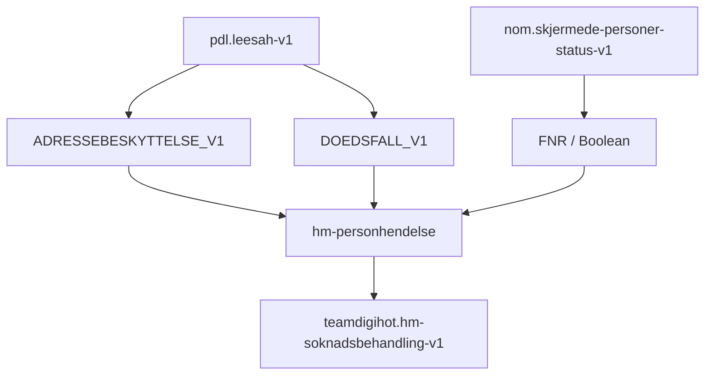

# hm-personhendelse

App som lytter på Kafka-emner for personhendelser (leesah og skjermede-personer-status)
og publiserer meldinger videre på DigiHoTs rapid. Appen er implementert med Kafka Streams.

